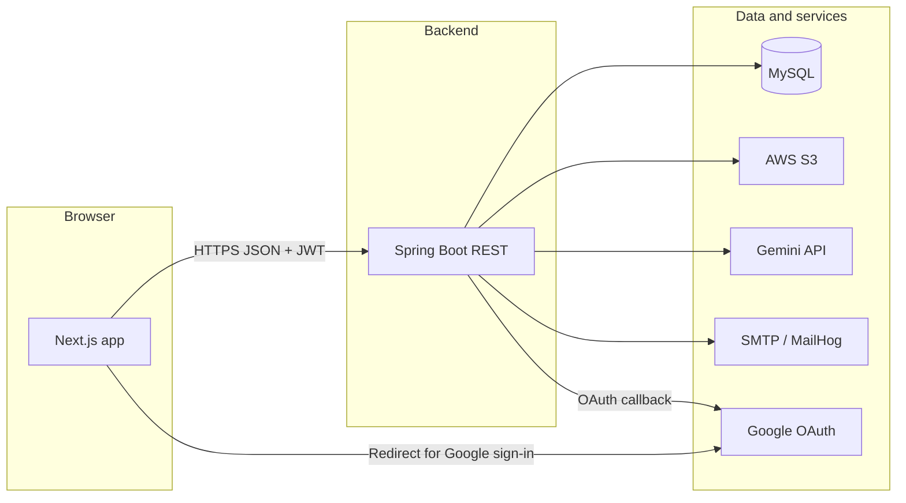

# MediVerse — Complete Project Overview

Single-file snapshot of **what MediVerse is**, **how it behaves end-to-end**, and **what it is built with**. Authoritative depth remains in **`ARCHITECTURE.md`** (design, schema, APIs) and **`WORKFLOWS.md`** (journeys, UX decisions).

---

## 1. What MediVerse is

**MediVerse** is a full-stack web platform connecting **patients** and **verified doctors**, with:

- **AI-assisted health guidance** (Gemini chat — guardrails; not a substitute for clinical care).
- **AI-assisted medical report scanning** (PDF/image → Vision model → structured summary and findings stored for the patient, optionally shared with one doctor).
- **Appointment booking** with hybrid flows (instant book vs approval required per availability rule).

**Roles (RBAC):** exactly **PATIENT** and **DOCTOR**. There is **no first-class ADMIN role**. Doctor license review uses a lightweight **`/admin/verifications`** UI and **`/api/admin/doctors/*`** endpoints, gated only by **`ADMIN_EMAILS`** (see §5.5).

---

## 2. Technology stack

| Concern | Technology |
|--------|------------|
| **Frontend** | **Next.js 14** (App Router), **TypeScript**, **Tailwind CSS**, **shadcn/ui** (Radix), **next-themes** |
| **Client state** | **Zustand** (auth session), **TanStack Query** (server state / caching) |
| **Forms / validation** | **React Hook Form**, **Zod** |
| **HTTP** | **Axios** (Bearer access token, refresh on 401) |
| **Backend** | **Spring Boot 3.5** on **Java 21**, **Maven** (system `mvn`, no committed wrapper) |
| **API shape** | JSON REST; every controller returns **`ApiResponse<T>`** (or void success); errors as JSON via global handler |
| **Security** | **Spring Security 6**, **JWT** (access + refresh), **Google OAuth2** (authorization code flow) |
| **Persistence** | **Spring Data JPA** / **Hibernate**, **Flyway** migrations |
| **Database** | **MySQL 8** (dev: typically host-installed; see **`memory-bank/techContext.md`**) |
| **Object storage** | **AWS S3** (SDK v2) — avatars, doctor license uploads, AI report files |
| **AI** | **Google Generative Language API (Gemini)** — chat + vision models via env (defaults e.g. `gemini-2.5-flash` / `gemini-2.5-pro`) |
| **Email** | **Spring Mail** / SMTP; local dev often **MailHog** via **Docker Compose** |
| **API docs** | **springdoc-openapi** — Swagger UI on the backend port |
| **Tests** | Backend: JUnit 5, **H2** for integration tests; frontend: ESLint + production build |

---

## 3. Runtime topology

| Service | Default URL / port (local) |
|--------|----------------------------|
| Frontend | `http://localhost:3000` |
| Backend | `http://localhost:8080` |
| API base (from browser) | `NEXT_PUBLIC_API_BASE_URL` → e.g. **`http://localhost:8080/api`** |
| MySQL | `localhost:3306` |
| Swagger UI | `http://localhost:8080/swagger-ui/index.html` |
| MailHog web | `http://localhost:8025` (SMTP `1025`) |

Env loading: backend uses **`DotenvBootstrap`** so a **repo-root** `.env` can populate unset Spring placeholders. Frontend reads **`NEXT_PUBLIC_*`** from its build-time environment. Template: **`.env.example`**.

---

## 4. End-to-end application flows

Flows below are **logical** sequences; routes and field names match the shipped app (`/patient`, `/doctor`, not legacy `/dashboard` names in older doc sketches).

### 4.1 Public / marketing

1. User lands on **`/`** — marketing sections (hero, features, FAQ, CTAs).
2. **Sign up** — **`/signup`** → choose **Patient** or **Doctor** → **`/signup/patient`** or **`/signup/doctor`** (doctor includes license file upload).
3. **Login** — **`/login`** (email/password and optional **Sign in with Google** if backend exposes OAuth).
4. **Email verification** — link in email → **`/verify-email?token=...`**; optional **resend** while logged in.
5. **Password reset** — **`/forgot-password`** → email → **`/reset-password?token=...`**.
6. **Google OAuth return** — **`/oauth/callback`** exchanges fragment tokens and hydrates session.

### 4.2 Authentication and session (technical)

1. Login/register responses include **access + refresh** JWTs and a **`UserDto`** (role, `emailVerified`, optional **`admin`** flag if email is in **`ADMIN_EMAILS`**).
2. Axios attaches **`Authorization: Bearer <access>`** on API calls.
3. On **401**, client attempts **`/api/auth/refresh`** once, updates store, retries; failure clears session and sends user to **`/login`**.

### 4.3 Patient application (after login)

Typical journeys (any order):

| Journey | Flow |
|--------|------|
| **Profile** | **`/patient/profile`** — demographics, health baseline, avatar. |
| **Onboarding** | Home dashboard calls **`GET /api/users/me/onboarding`** — checklist until complete. |
| **Email banner** | If unverified, banner + resend + link to verify flow. |
| **Find & book** | **`/patient/doctors`** → search/filter → **`/patient/doctors/[id]`** → pick date/slot → book (respects **7-day horizon**, **2h cancel** window). |
| **Appointments** | **`/patient/appointments`** — list, cancel within rules, view status. |
| **AI assistant** | **`/patient/ai-assistant`** — chat sessions to Gemini (guardrails in backend). |
| **AI reports** | **`/patient/ai-reports`** — upload → **`/patient/ai-reports/scan`** — list/detail; optional **share** with a doctor (doctor sees only shared report). |

### 4.4 Doctor application (after login)

| Journey | Flow |
|--------|------|
| **Verification** | New doctors may be **PENDING** until allowlisted admin approves; **REJECTED** shows banner. **`DoctorPublicDto.verificationStatus`** drives UI. |
| **Profile** | **`/doctor/profile`** — specialization, fee, bio, photo, practice fields. |
| **Availability** | **`/doctor/availability`** — weekly rules (and overrides as implemented) → slots generated for booking. |
| **Appointments** | **`/doctor/appointments`** — pending approvals, confirm/reject/complete. |
| **Dashboard** | **`/doctor`** — stats (today / week / patients). |
| **Shared reports** | **`/doctor/reports/[id]`** — read-only if patient shared that report with this doctor. |

### 4.5 Admin verification (email allowlist)

1. Operator email appears in **`ADMIN_EMAILS`** (comma-separated, repo **`.env`**).
2. After login, **`UserDto.admin`** is **true**; nav can show **Verifications**.
3. **`/admin/verifications`** lists **`GET /api/admin/doctors/pending`**, **approve** / **reject** (optional reason email).
4. **403** if not allowlisted — UI explains configuration.

This is **not** a separate product role in the database; it is **operational access** only.

### 4.6 Cross-cutting

- **Transactional email** — welcome, verification, password reset, appointment lifecycle (MailHog captures in dev).
- **File uploads** — multipart endpoints; S3 keys behind **`StorageService`**.
- **AI errors** — e.g. Gemini **503** surfaced as **`upstreamUnavailable`**; user may retry or switch models (see **`memory-bank/progress.md`** reminders).

### 4.7 Practice location & patient navigation

1. **Doctor** sets street / map pin on **`/doctor/profile`** (optional Google Maps JS key: Places + map + geolocation).
2. Stored on **`doctors`** (`V8` city/languages, **`V9`** formatted address + lat/lng + place id).
3. **Patient** appointment list + home “next visit” include **Navigate** links to **`google.com/maps` directions** when the doctor saved coordinates or text (no Maps API key needed for those URLs).

---

## 5. Build phases (status)

All planned phases **0–8** are implemented for the current v1 scope (see **`memory-bank/progress.md`**). Phase 8 added **admin verification UI**, **onboarding checklists**, **banners**, and related polish; **practice address + patient Navigate** shipped incrementally afterward (Flyway **V9**, see **`ARCHITECTURE.md`**).

---

## 6. Non-goals (v1)

No payments, no video visits, no prescriptions, no peer reviews, no streaming LLM tokens, no i18n, no mobile apps — see **`ARCHITECTURE.md`** §15 and **`WORKFLOWS.md`** decision table.

---

## 7. Where to read next

| Document | Use for |
|----------|---------|
| **`ARCHITECTURE.md`** | DB schema, package layout, security model, full API surface, Flyway history |
| **`WORKFLOWS.md`** | Screen-by-screen journeys, locked product decisions |
| **`README.md`** | Quick start, env vars, verify commands |
| **`memory-bank/techContext.md`** | Exact versions, ports, env var list, test profile notes |
| **`memory-bank/progress.md`** | Phase checklist, test count, recent git tip |

---

*Last aligned with repo state: Phase 8 plus practice location (V9), patient Navigate, slot-list stability fixes, doctor profile Maps + geolocation UX.*
